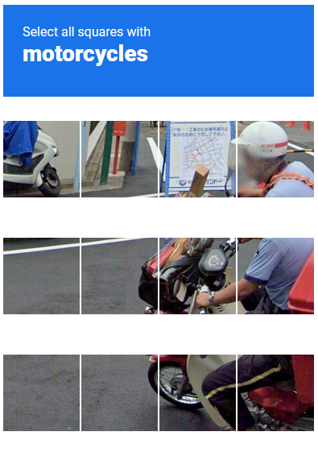

# When viewing reCAPTCHA "click all the ___ images"

> For: google.com/sorry || "I'm not a robot" pages

Inspect the iframe on the captive captcha page, you will see something that looks like this:

'''html
#document
<html>
<head></head>

<body style="height: 100%">
'''

If you change the it from 100% to `<body style = "height: 10%"`, you will be able to see all of the photos as well as the verify button.